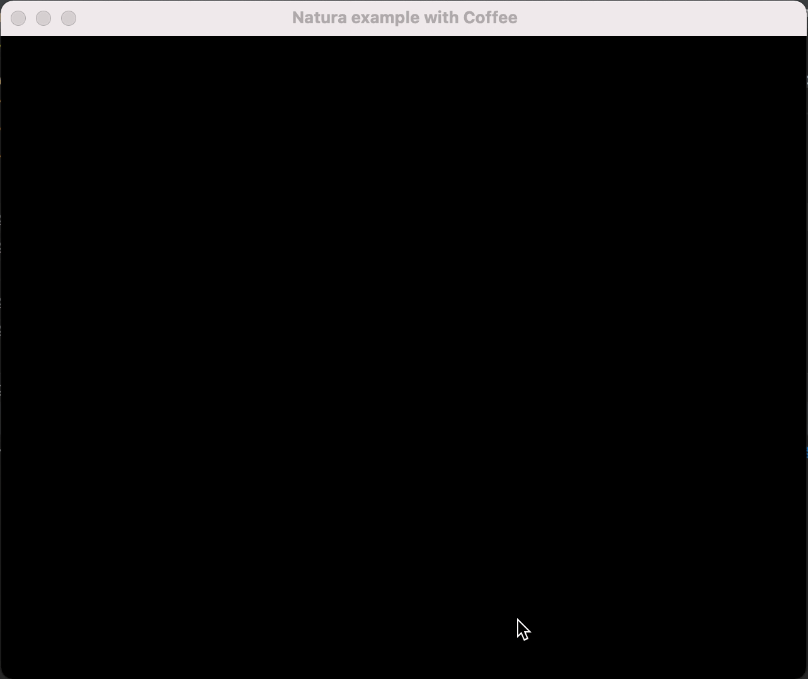

# Natura 🔥
A simple, efficient spring animation library for smooth, natural motion in Rust



## USAGE
```rust
// A thing we want to animate.
#[derive(Default)]
struct Sprite {
    x: f64,
    x_velocity: f64,
    y: f64,
    y_velocity: f64,
}

// Where we want to animate it.
const TARGET_X: f64 = 50.0;
const TARGET_Y: f64 = 100.0;

fn main() {
    let mut sprite = Sprite::default();
 
    // initialize a spring with frame-rate, angular frequency, and damping values.
    let mut spring = Spring::new(natura::fps(60), 6.0, 0.5);

    loop {
        let (sprite_x, sprite_x_velocity) = spring.update(sprite.x, sprite.x_velocity, TARGET_X);
        sprite.x = sprite_x;
        sprite.x_velocity = sprite_x_velocity;

        let (sprite_y, sprite_y_velocity) = spring.update(sprite.y, sprite.y_velocity, TARGET_Y);
        sprite.y = sprite_y;
        sprite.y_velocity = sprite_y_velocity;

        sleep(Duration::from_millis(10000));

        // use new position here on every frame
        println!(
            "Sprite x:{}, y:{}, x_vel:{}, y_vel:{}",
            sprite.x, sprite.y, sprite.x_velocity, sprite.y_velocity
        )
    }
}
```


## Examples
- Example with [2D engine `coffee`](https://github.com/hecrj/coffee) 
```rust
use std::fmt;
use std::fmt::Formatter;
use coffee::graphics::{
    Color, Frame, Mesh, Rectangle, Shape, Window, WindowSettings,
};
use coffee::load::Task;
use coffee::{Game, Timer};

use natura::*;

fn main() -> coffee::Result<()> {
    NaturaExample::run(WindowSettings {
        title: String::from(" Natura example with Coffee"),
        size: (1280, 1024),
        resizable: true,
        fullscreen: false,
        maximized: false,
    })
}


// where we want to animate it.
const TARGET_X: f64 = 300.0;
const TARGET_Y: f64 = 500.0;

// A thing we want to animate.
#[derive(Default)]
struct RectSprite {
    x: f64,
    x_velocity: f64,
    y: f64,
    y_velocity: f64,
}

struct NaturaExample {
    sprite: RectSprite,
    spring: Spring,
}

impl Game for NaturaExample {
    type Input = ();
    type LoadingScreen = ();

    fn load(_window: &Window) -> Task<NaturaExample> {
        
        Task::succeed(|| NaturaExample {
            sprite: RectSprite::default(),
            spring: Spring::new(natura::fps(60), 6.0, 0.5), // initialize a spring with frame-rate, angular frequency, and damping values.
        })
    }

    fn draw(&mut self, frame: &mut Frame, _timer: &Timer) {
        frame.clear(Color::BLACK);
        let mut mesh = Mesh::new();
        let (sprite_x, sprite_x_velocity) = self.spring.update(self.sprite.x, self.sprite.x_velocity, TARGET_X);
        self.sprite.x = sprite_x;
        self.sprite.x_velocity = sprite_x_velocity;

        let (sprite_y, sprite_y_velocity) = self.spring.update(self.sprite.y, self.sprite.y_velocity, TARGET_Y);
        self.sprite.y = sprite_y;
        self.sprite.y_velocity = sprite_y_velocity;

        // use new position here on every frame
        mesh.fill(
            Shape::Rectangle(Rectangle {
                x: self.sprite.x as f32,
                y: self.sprite.y as f32,
                width: 200.0,
                height: 100.0,
            }),
            Color::WHITE,
        );
        mesh.draw(&mut frame.as_target());
    }
}
```
